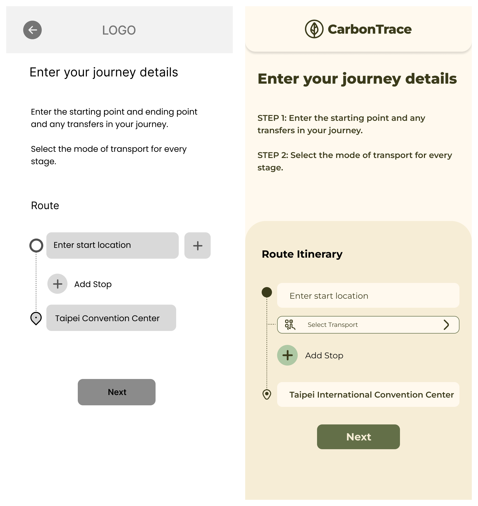
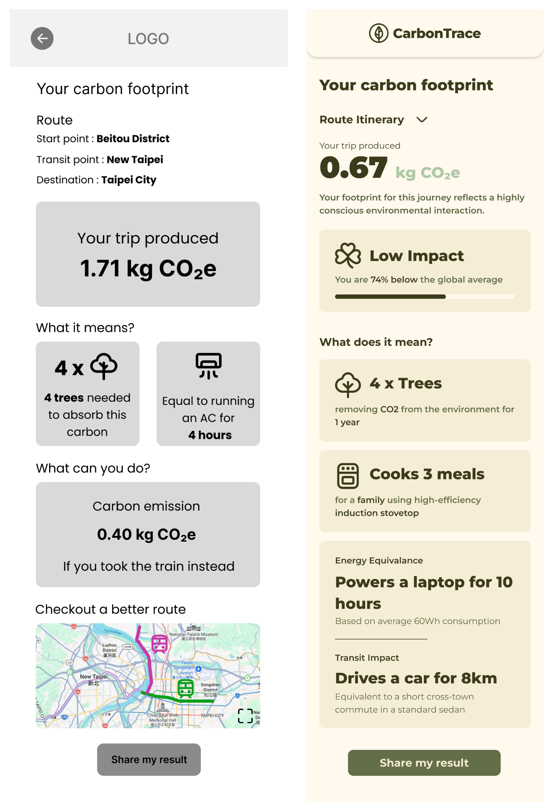
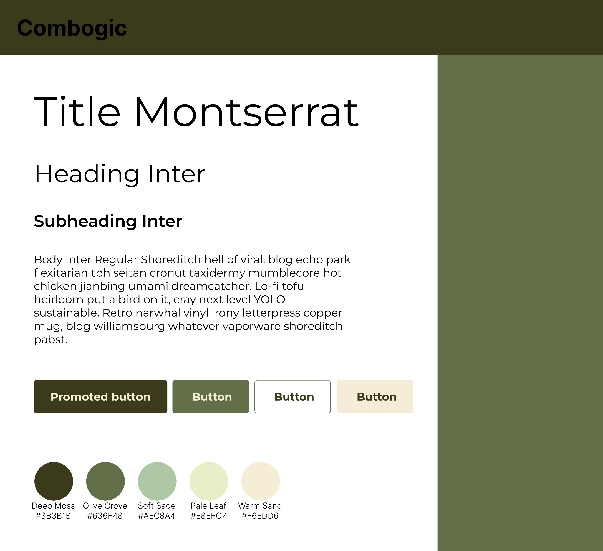
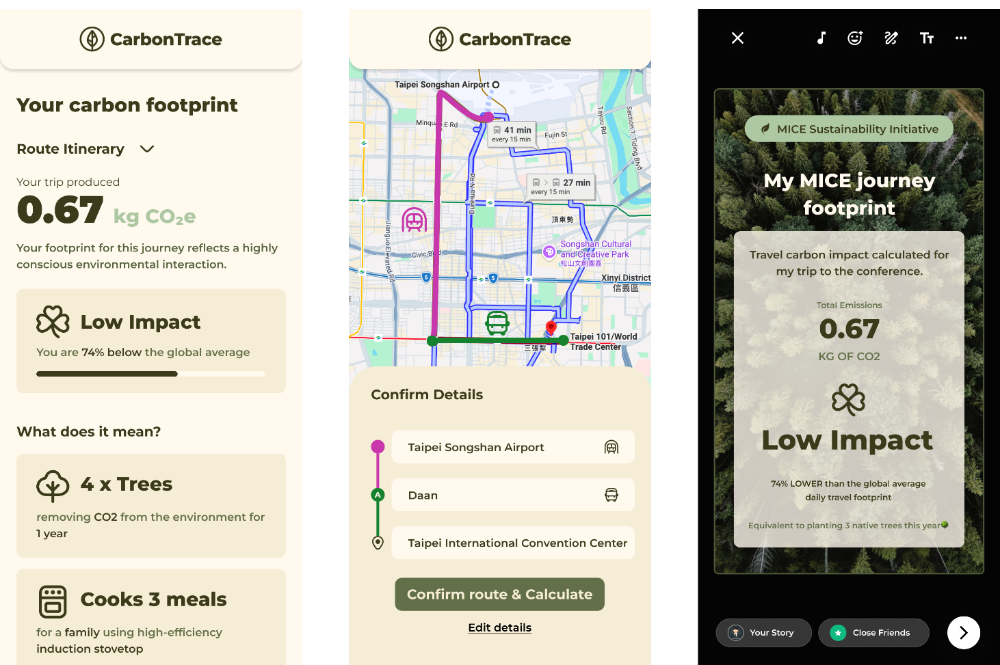
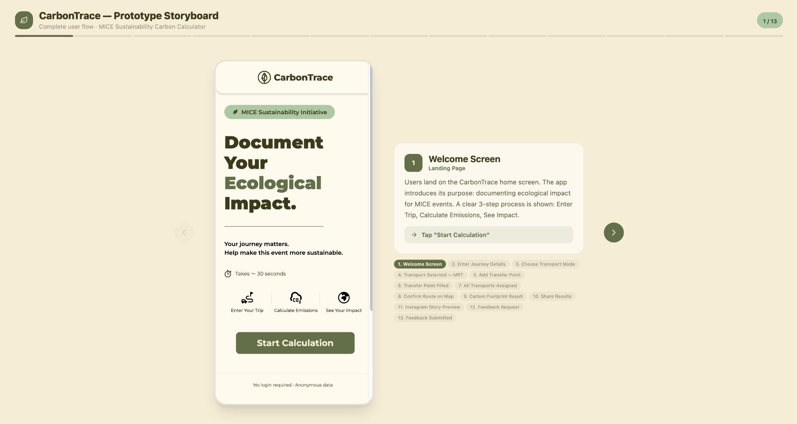

## The problem

Combogic Technology is a Taiwanese ESG startup. Their product, CarbonTrace, lets people
attending conferences and exhibitions scan a QR code, enter how they travelled, and get
an estimate of the carbon footprint of their trip. Event organisers then use the totals
for sustainability reporting.

At a recent large-scale event, out of hundreds of attendees, roughly **45** finished the
submission. Organisers had heard the platform was "difficult to use", but no formal UX
research had ever been run, so nobody knew which part of it was failing.

That matters more than it sounds. The organisers' reports are only as reliable as the
number of attendees who complete a submission, so a usability problem at the attendee
end becomes a data-quality problem at the business end.

## What made this hard

The constraints shaped everything. Attendees use the platform **once or twice, ever**,
standing up, in a busy venue, with no account and no reason to be patient. Access is
anonymous by QR code and no email address is collected — which is also why we could not
recruit participants directly, and had to go through the client's own network. The user
base was small to begin with: only those 40–50 people had ever completed the flow.

## Research

Five methods, chosen so that no single weak source carried the argument:

- **Five semi-structured interviews** with real attendees in Taiwan, conducted in
  Mandarin and translated by bilingual teammates. I moderated these.
- **A bilingual survey** (English and Traditional Chinese), 16 items. Four responses —
  genuinely a small number, so we used it to triangulate rather than to prove anything.
- **A heuristic evaluation** against Nielsen's ten heuristics, covering login, the
  calculator and the management console, with each issue rated for severity.
- **A literature review** of five peer-reviewed papers across gamification, eco-feedback
  for behaviour change, and web form usability.
- **An analogous product analysis** of three comparable tools, including a carbon
  calculator and a gamified sustainability app.

We coded the interview notes independently, then clustered them into an affinity diagram
in FigJam — bottom-up, because there was no prior usability data to test against. That
produced five themes across fifteen sub-clusters.

## What we found

Three findings did the work, and each had a direct design consequence.

**Nobody could enter a real journey.** Five out of five participants had made trips that
combined modes — bus, then MRT, then a taxi — and the form only accepted one. Forcing a
single choice made the result both wrong and annoying.

**The number meant nothing.** A figure in kilograms of CO₂e carries no information for
someone who does not work in carbon accounting.

> I have no concept of how much CO2 that represents. Even as a government employee,
> these calculation units mean nothing to me.

**Typing addresses on a phone was too slow.** There was no auto-complete, and manual
entry in a crowded venue is exactly where people give up.

## Two prototypes, tested against each other

Rather than design one flow and defend it, we built two and let participants decide.

**Version A** went minimal and icon-driven. Clean, but with no explicit sequence: it was
never obvious whether you were adding a stop or picking a transport mode.

**Version B** used explicit text labels and a vertical, sequential structure —
location, transport, location — deliberately mirroring how someone actually
reconstructs a trip from memory.

Version A on the left, Version B on the right. Same task, same data model, opposite
philosophies about how much to say out loud.

I moderated all six usability sessions, with a teammate taking notes and a five-minute
debrief between each one so we caught disagreements while they were still fresh. Six
participants, three in English and three in Mandarin, each used **both** versions in
counterbalanced order. We chose a within-subjects comparison over a conventional split
test because six people cannot produce a meaningful group-level result — but six people
who have used both can tell you exactly why they prefer one.

## The result

**Version B, unanimously — six out of six.** The redesigned flow scored **82.9** on the
System Usability Scale, peaking at **97.5** with individual participants, with error
rates well down.

The lesson generalises past this project: in a fast, distracted, one-time-use context,
clarity beats minimalism. Explicit labels are not visual clutter; they are the thing
doing the work.

## What testing found that we had not

The everyday equivalences did their job — trees, hours of air conditioning, meals cooked
all successfully turned an abstract number into something people could picture. But
participants kept asking a question we had not designed an answer to: *is that good?*
They had no way to know whether their footprint was high, low or average compared with
everyone else at the same event.

Equivalences alone, then equivalences plus a benchmark. The comparison bar on the right
is the direct answer to a question testing surfaced, and event-level peer comparison
became our main recommendation for the next release.

## The design system

The visual work was built as a system rather than a set of screens, because the whole
point was to hand it to Combogic's developers and have it survive.

Montserrat for display, Inter for text, and a palette that stays close to the product's
subject without turning into the usual sustainability green.

The output half of the flow — result, route confirmation, and a shareable card, since
sharing was one of the few motivations that tested well.

The storyboard we used to walk the client through the flow before handoff.

## Scope

We set out to redesign the attendee mobile submission flow and explicitly ruled out
account creation, login, and any rework of the organiser dashboard. We finished having
changed exactly that and nothing else, which is the part I am most pleased about — the
temptation in a capstone is to redesign everything and validate none of it.

The final handoff was an interactive high-fidelity prototype, the design system, and
written specifications.

## What I learned

Testing two real options beats testing one. If we had built only Version B, we would
have shipped it and called the positive feedback a success; because Version A existed,
we can say *why* B works, and that reasoning transfers to the next screen we design.

The other lesson is that the most useful finding was the one that made our work look
incomplete. The equivalences tested well, and it would have been easy to stop there and
report a win. The genuinely valuable output was the gap participants pointed at — that
without social comparison, a number still has no stakes.
