## The problem

How do you help people who commute long distances to work or school feel less isolated,
and address the safety concerns of travelling alone?

This started close to home: most of the team took public transit to campus, and the
journey was boring, tedious and meaningless. We wanted to fix our own commute.

## The pivot

My initial research direction was carpooling. That research is what killed it — I found
a crowded field of dedicated carpooling platforms the team had not known existed, which
undermined our whole premise.

I led the discussion on changing direction and proposed focusing on public-transit
commuters instead, a far less explored category. The team agreed, and that pivot defined
the rest of the project.

## Competitor analysis

I identified one direct competitor, SmartCommute.ca, and two indirect ones, Uber and
Facebook Communities. I then tested SmartCommute myself and found four concrete
failures: no built-in messaging, too much planning required up front, difficult
navigation, and excessive setup before any value appeared. Each became something our
design had to avoid.

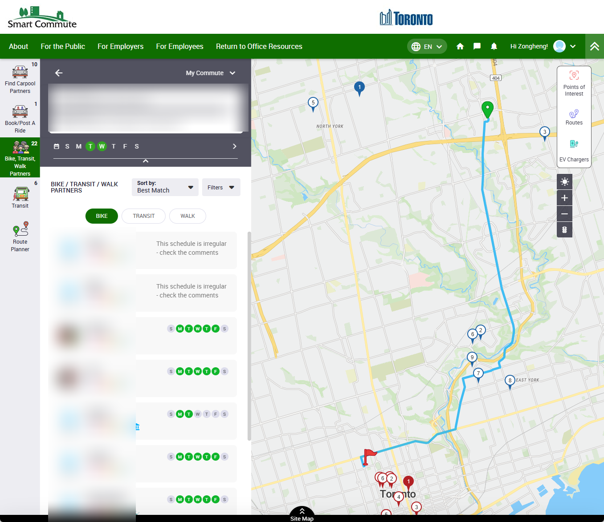

SmartCommute mid-task, with names and addresses blurred. The problem is legible in the
layout alone — six competing navigation targets, a form to complete before anything
happens, and still no way to message the person you matched with.

## User research

I interviewed two participants matching our target demographic of frequent transit
commuters, and analysed five of the team's ten interviews. We reduced the scripts to
keywords and sorted those into affinity diagrams, using frequency to find the pain
points that actually recurred rather than the ones that were merely vivid.

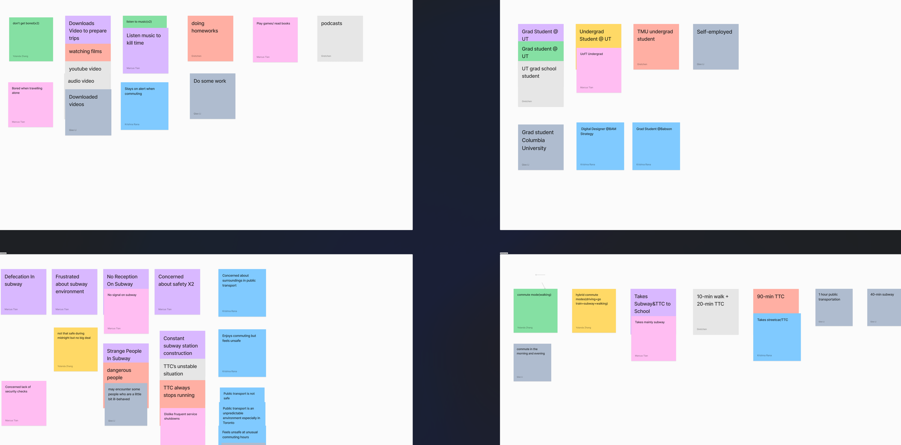

Ten interviews reduced to keywords, then clustered. What decided our priorities was how
often something came up, not how memorably it was said.

## Journey mapping

From the interview findings I built an AS-IS map of the experience as it already existed.

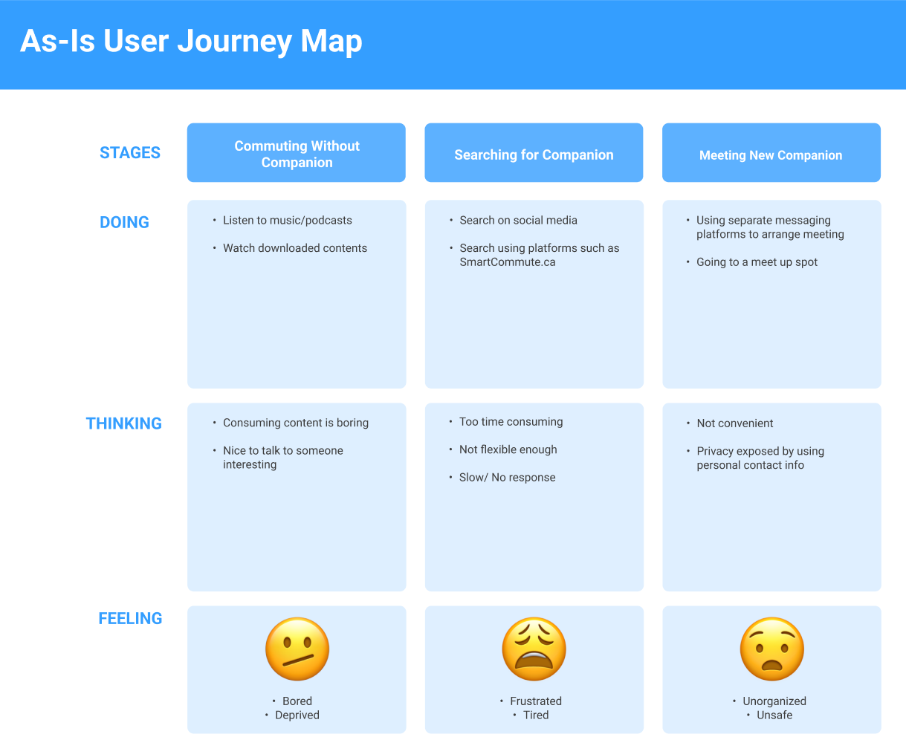

The feeling row is the one that mattered: bored and deprived, then frustrated and tired,
then unorganised and unsafe. Three stages, and not one good moment in any of them.

## Sketches, flow, storyboard

I sketched the route-setup task, drew it as a flow, then combined the two into a
storyboard so the team could review screens and logic together.

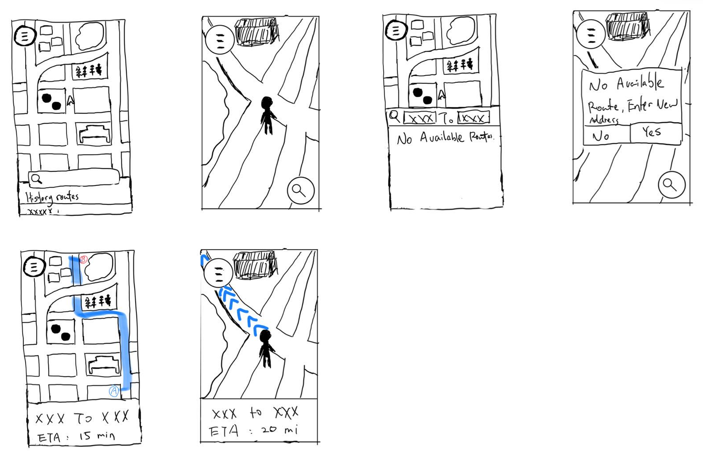

Sketches for route setup, including the failure case.

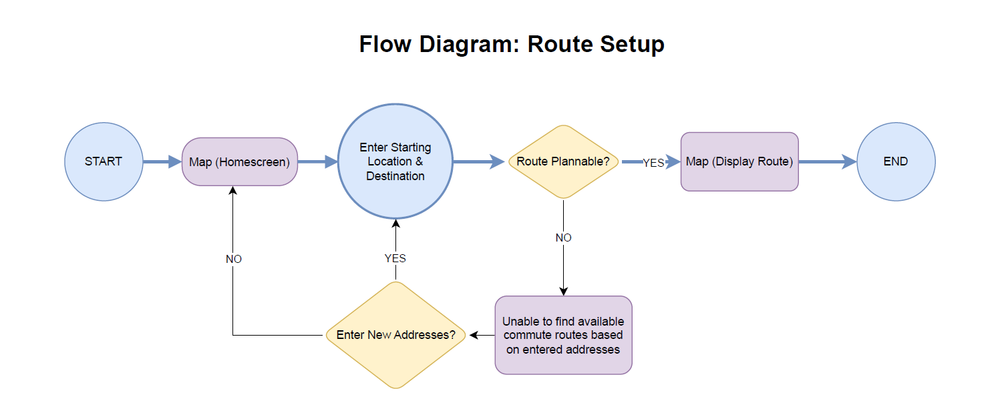

Drawing the same task as a flow is what surfaced the unplannable-route branch, which the
sketches alone had skipped.

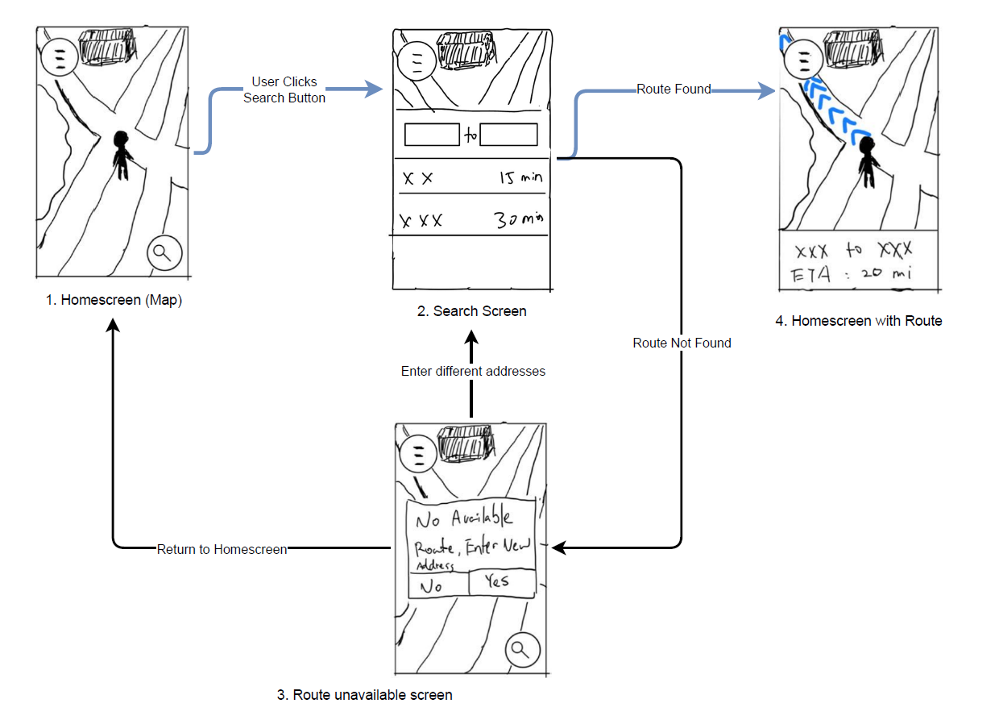

The two combined into one artefact.

## Prioritisation

The team pooled every design idea we had generated and sorted them by implementation
effort against impact on the experience, so the trade-offs were explicit before anyone
started building.

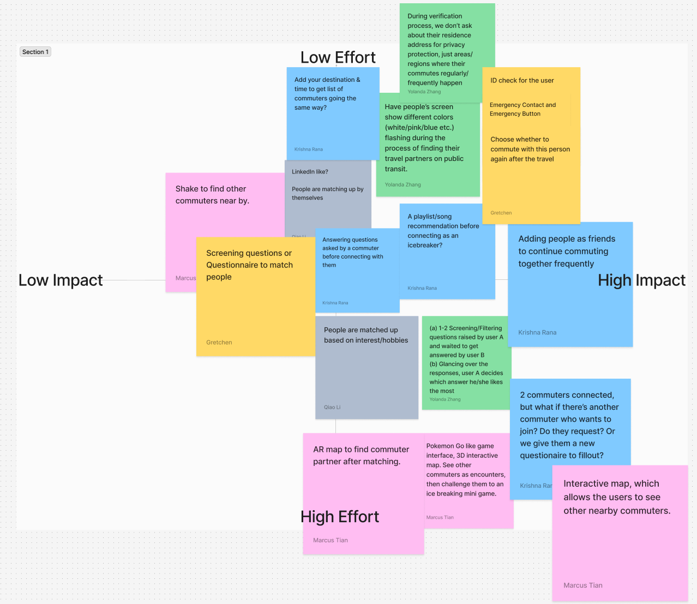

Ideas plotted rather than argued about. The cheap, high-impact quadrant set the scope of
the prototype.

## Wireframes and testing

The team built low-fidelity wireframes and a clickable prototype collaboratively, then
tested it with students in the practicum. I ran one session, taking notes as the
participant moved through the prototype and asking follow-ups — *was there anything you
found confusing*, *what do you think this prototype is for*.

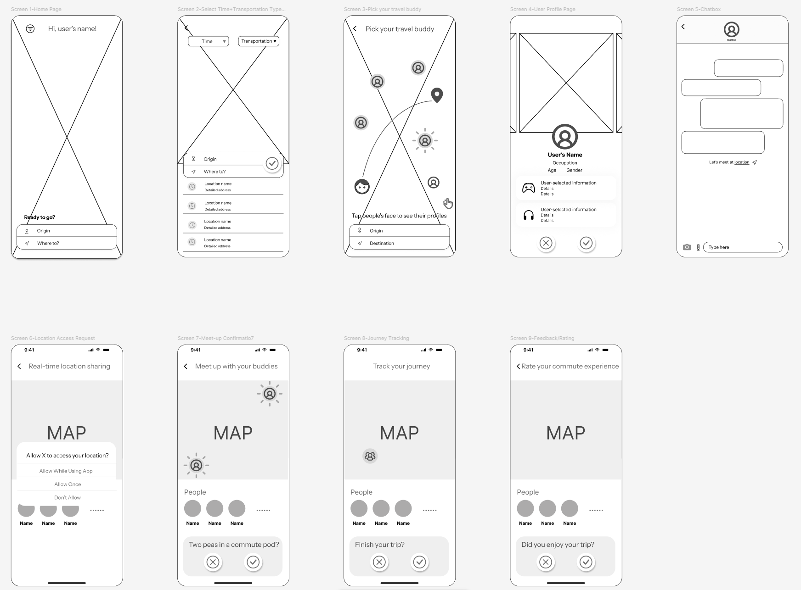

Deliberately unstyled, so testing produced feedback about the flow rather than about the
colours.

## Visual direction

The team assembled a mood board around vibrant, bright colour — we wanted the product to
feel engaging and friendly rather than utilitarian. I then designed the style tile from
it, choosing orange and light blue: two contrasting colours that complement rather than
compete, on a white ground with black type. The team adopted my style tile for the final
design.

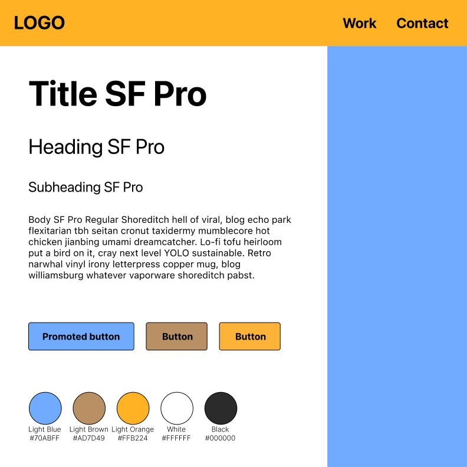

Light blue `#70ABFF`, light orange `#FFB224` and a light brown `#AD7D49` for warmth,
against white and black.

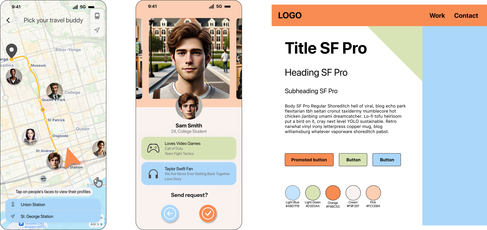

My own high-fidelity mock-up, built from a modified version of the style tile.

## The final design

The team brought our individual mock-ups together and worked the final version
collaboratively. The flow runs from planning a route, to finding someone travelling the
same way, to a profile, to a conversation — and ends somewhere most matching products
never go, at actually meeting up.

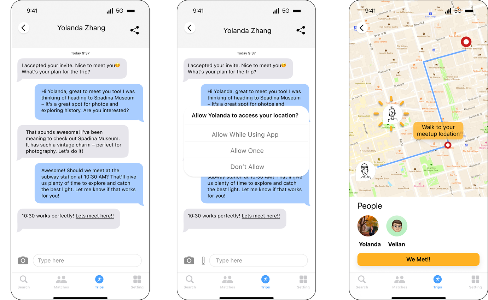

The end of the journey. Location sharing is asked for at the moment it becomes useful,
not at sign-up, and confirming you met is what closes the loop.

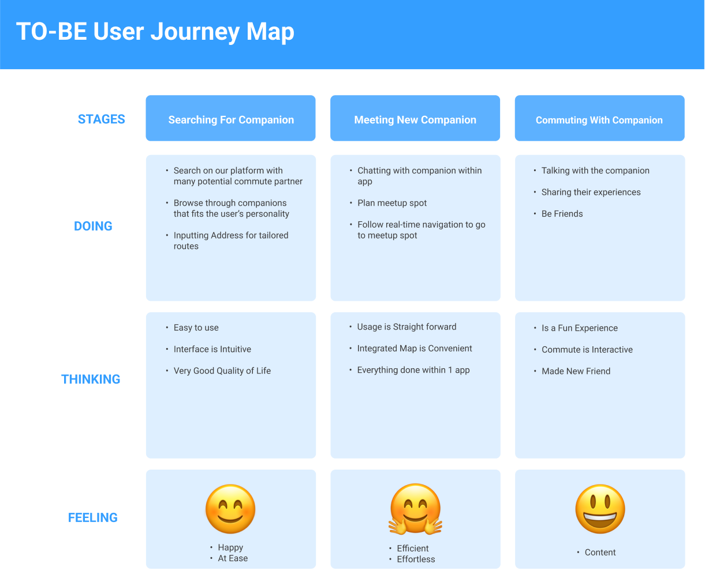

The AS-IS map again, redrawn against the finished design. Putting them side by side is
the clearest statement of what the project was for.

## What I learned

Flexibility mattered more than commitment. Pivoting from a generic ride-sharing concept
to a niche one was the single decision that made the project work.

The interviews were harder than expected — early responses were shallow, and the fix was
better follow-up questions rather than more participants. That skill transferred to
everything since.

The limits are worth stating plainly. Matching would get harder to scale, not easier,
as the user base grows; trust is difficult to establish in interactions this brief, even
with verification; and the biggest barrier is habit, because people are reluctant to
change a routine that already works.
