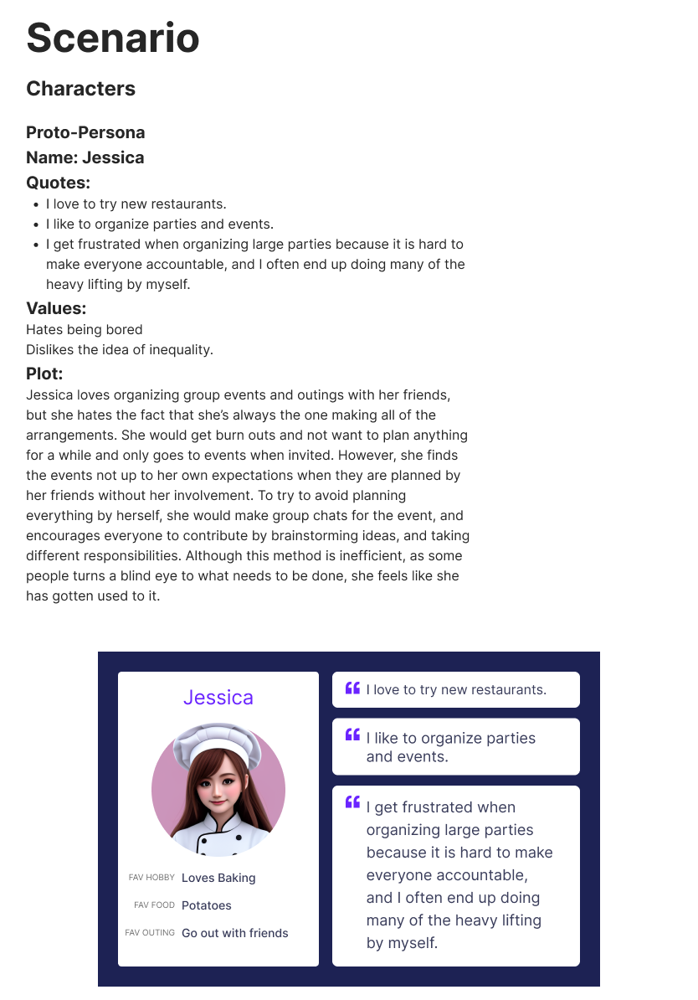
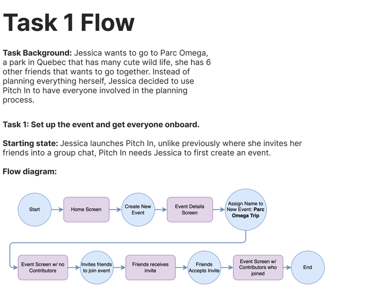
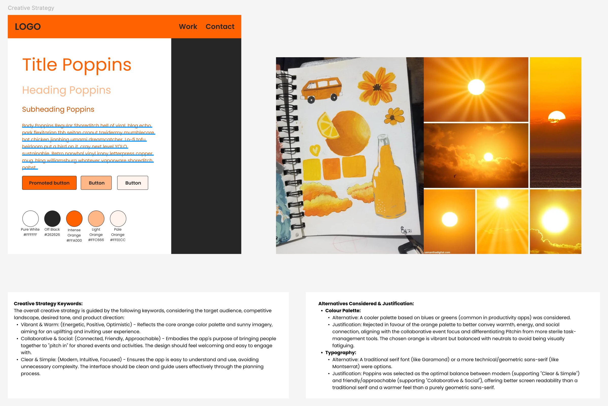
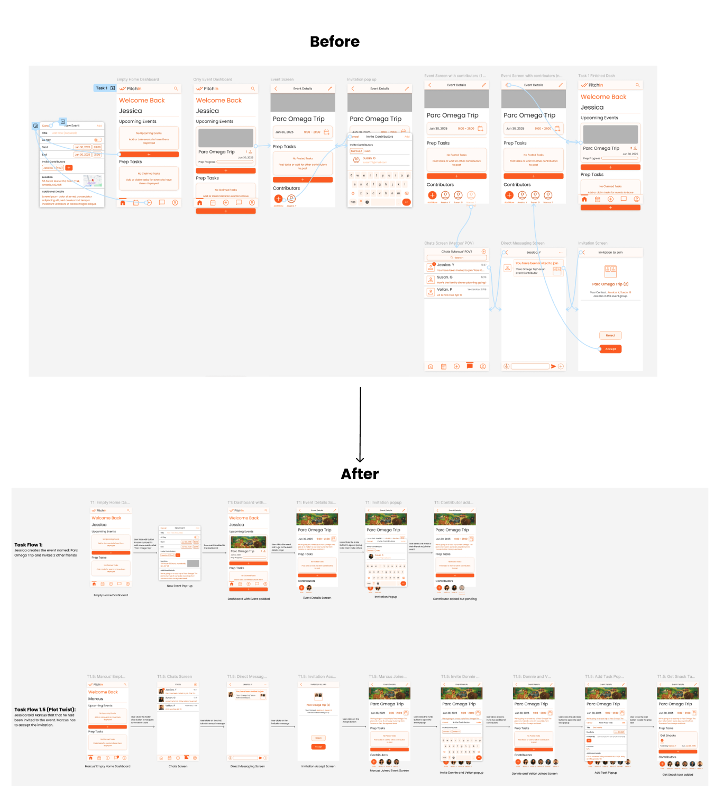
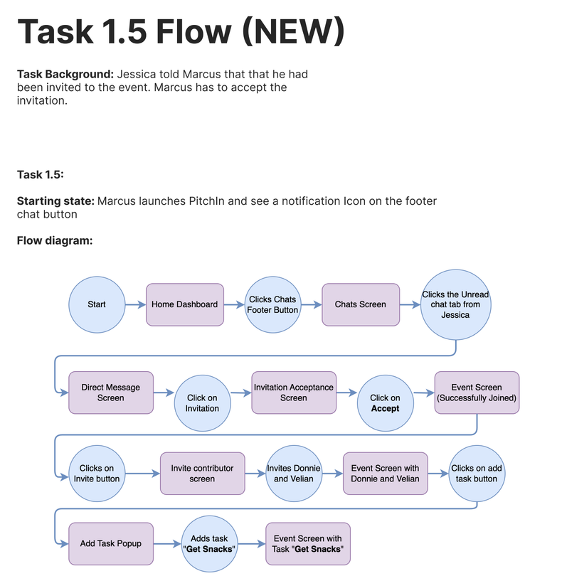
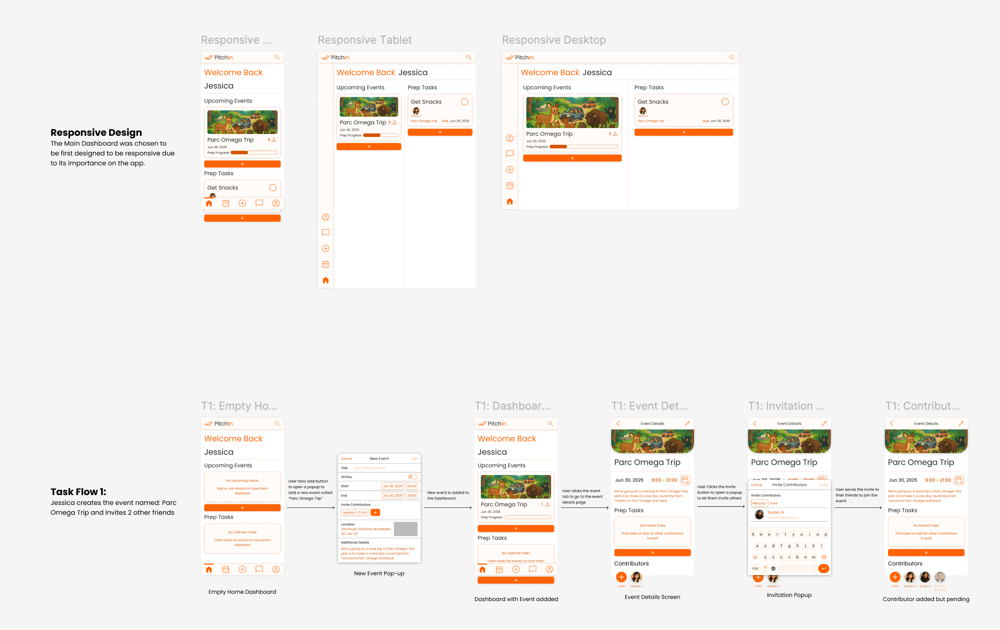
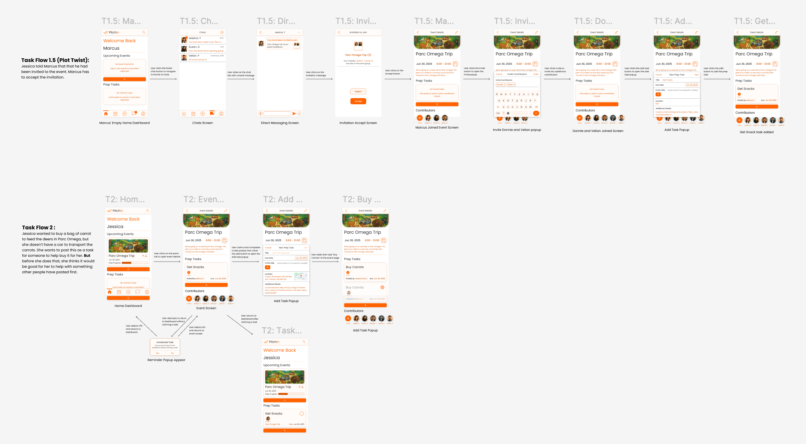

## The problem

When a small group organises something together — a trip, a dinner, a birthday — the
work does not distribute evenly. One or two people absorb it. They have no formal
authority to delegate, no way to show what has already been done, and no record of who
contributed what. Everyone else is willing but uninformed.

Group chats do not fix this, because a chat has no structure: nothing in it can hold a
task, a cost or a commitment. Professional planning tools do not fix it either, because
they assume a hierarchy that a group of friends does not have.

PitchIn is built for the gap in between — groups of roughly ten to fifty people who
already trust each other and need transparency rather than management.

## Defining the user

I wrote a proto-persona and a to-be scenario before designing anything, so that every
later decision had something concrete to answer to.

Jessica likes organising and resents being the only one doing it. Her scenario — planning
a group trip to Parc Omega — became the spine of the whole project, including the
prototype's content.

## The two tasks

From the scenario I defined the two tasks the product had to make effortless: setting up
an event and inviting people, and adding preparation tasks and managing who does them.
I drew both as flows, including the branches that make them realistic — an invitation
sitting unaccepted, a task nobody has claimed.

Task 1 end to end. I drew the awkward case as its own path too — an invitation sent but
not yet accepted, where the person still appears on the event, marked pending.

I also modelled the objects behind all of this — Event, Contributor, Task, Invitation —
which is what kept the two flows consistent with each other.

## Visual direction and design system

I built a mood board around three keywords: **vibrant and warm**, **collaborative and
social**, **clear and simple**. The intent was something uplifting and inviting that
still let people concentrate. The style tile that came out of it uses warm orange against
balanced neutrals, set in Poppins.

I documented why, not just what. Orange was chosen over blue-green because most
productivity apps go cool and this product is social; Poppins over a traditional serif
because it reads as modern and geometric without becoming cold.

That direction then became an actual system in Figma rather than a set of screens: a
four-column mobile grid with defined margins and gutters, colour as variables named by
role — highlight, call to action, inactive, background, neutral — a type scale bound to
styles, icons from Material Symbols, and reusable components for buttons, event tiles
and inputs.

Naming colours by role rather than by hue is the part I would keep doing. It meant a
palette change never required hunting through screens.

## What testing found

I planned and ran usability tests combining a five-second test for first impressions,
unscripted think-aloud exploration, and scripted tasks. Then I took peer critique on top
of it. Four issues were serious enough to require real change:

- **The point of view switched mid-flow.** The prototype asked the participant to become
  a friend who had been invited, accept the invitation, then switch back. Even after
  explaining it beforehand, this consistently confused people and added mental load.
- **Task status was unreadable.** A circular icon on each task card was doing two jobs —
  claiming a task and marking it complete — and looked like neither. Participants could
  not tell whether it was an indicator or a control, and expected a checkbox.
- **The words were wrong.** "Contributor" did not land; participants suggested "members".
  "Self-assign" was worse, because it collided with claiming a task somebody else had
  posted.
- **Tasks lacked context.** "Get snacks" and "buy carrots" are not actionable on their
  own, and participants tried to tap task cards expecting a detail view that did not
  exist.

## What changed

The point-of-view problem I fixed structurally, by giving the second perspective its own
flow instead of interrupting the first.

Before and after. The change is organisational rather than visual — the same screens,
sequenced so the participant is never asked to switch identity inside a single task.

The new Flow 1.5, which exists entirely because of testing.

The remaining three I resolved in the interface: standard checkboxes with distinct
states for unclaimed, claimed and complete; "claim task" in place of "self-assign"; and
an optional description on tasks, with the cards made properly tappable.

## The final design

I applied the visual direction and the testing fixes to produce high-fidelity mock-ups
and an updated interactive prototype, with realistic content throughout rather than
placeholder text.

Mobile-first, but checked at tablet and desktop rather than assumed.

Every screen in both flows, with content that carries through correctly from one to the
next.

## What I learned

The most valuable finding was one I could not have designed my way out of. The
point-of-view switch felt fine to me because I knew why it was there — I had explained it
before each session, which should have been the warning. Explaining a flow to a
participant is a sign the flow is wrong, and re-sequencing it was cheaper than defending
it.

Building the design system alongside the screens rather than after them was the other
thing worth keeping. Semantic colour names and real components meant late changes stayed
cheap, at a stage in a project where changes normally stop being affordable.
