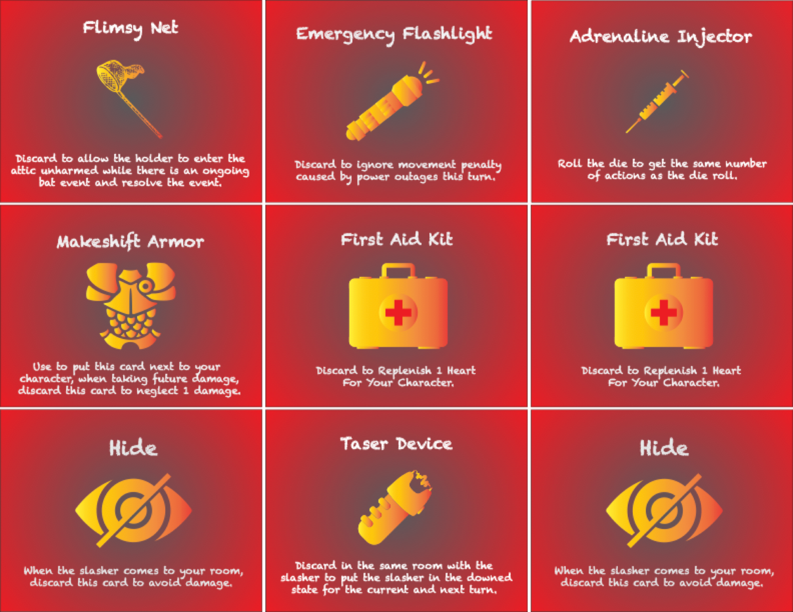

## The problem

Cooperative horror games have to hold two things in tension: players must feel genuine
pressure from a threat, and they must still want to keep playing. Push the difficulty
and it stops being fun; soften it and the horror evaporates.

## What I did

**Core mechanics.** Designed the gameplay loop — players move through a mansion, work
together to evade the slasher, and collect artefacts to exorcise it. Each player holds
a distinct role with unique abilities. Dice drive the slasher's movement and trigger
room-based disasters, so no two sessions run the same.

**Two rounds of user evaluation.** The first playtest used a low-fidelity prototype
hand-drawn on A4 sheets, with participants aged 21–22. It surfaced the real problem:
players read the game as collaborative, but could not actually play it without a
facilitator explaining the rules. They also avoided action cards entirely — a signal
the card system was too complex to reach for under pressure.

**Iteration.** We built a high-fidelity prototype with graphic design matched to the
slasher theme and a full rulebook. The action-card mechanics were simplified so players
would actually use them.

The redesigned action cards, as sent to print. One icon, one sentence, one decision —
the earlier versions asked players to parse a paragraph while a slasher was two rooms
away, which is why nobody used them.

**Randomness as a design tool.** Introduced controlled randomness to raise replayability
without making outcomes feel arbitrary, and tuned difficulty so the threat stayed
credible without overwhelming the table.

**Accessibility.** Identified and fixed readability, colour-contrast and inclusivity
problems in the card and board artwork.

## What the testing changed

The most useful finding was the one we had not designed for: a game can be perfectly
balanced and still fail because nobody can learn it unaided. Most of the second
iteration went into onboarding — rulebook structure and card legibility — rather than
into the mechanics themselves.
